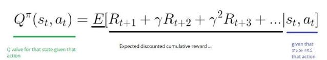
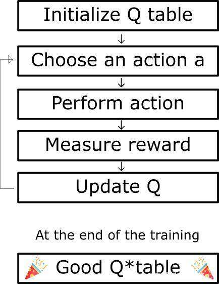

# Abstract
A simple implement of Q-learning. Use QL algorithm to thrain an agent that can play FrozenLake.

## Environment
* win10
* python3.6
* OpenAI Gym
* numpy
  
**configuration**
> pip install gym

> pip install numpy

## Intro: Q-learning
Q-learning is a value-based and model-free Reinforcement Learning algorithm

The main idea is keep updating Q(s, a) until the algorithm congerged. Q(s, a) is a action-value function with two input: '*state*' and '*action*', which used to evaluate how good the action is. The definition of Q(s, a) is:

When take action a at state s, the agent will go to a new state s' and receive a reward r, and then update Q(s, a). The basic flow of Q-learning is:

Update Q(s, a) by:

Q[s,a] ←Q[s,a] + α(r+ γmax Q[s',a'] - Q[s,a])

Another problem is at the beginning of trainning, the Q table is empty, so it can't help to chose a better action, thus need to do exploration(i.e. take random actions). With the training process unfolding, exploit the Q table could help to chose an action. So the tradeoff between exploration and exploitation is significant. epsilon-greedy algorithm may be a good choice to deal with this situation. At the beginning, epsilon equals to 1, because the Q table need exploration to be filled. Then the epsilon(i.e. exploration probability) decay following a constant decay rate.

## Start
* This example is very simple to understand Q-learning.
* The code has detailed annotations to help you comprehending.
* you can test by
  > python ql_play.py
